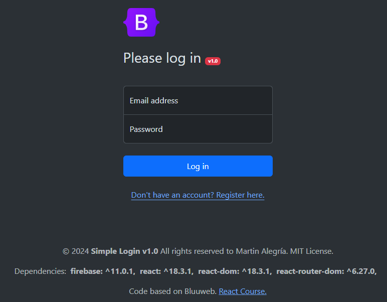

# Simple Login v1.0

### This version of the code implements a simple login with firebase.

Detail: 
- **React 18.3.1**
- **Bootstrap 5.3.0 (CDN)**
- **vite 5.4.8**
- **firebase 11.0.1**

**Disclaimer**: You must rename the **".env.example"** file to **".env.local"** and add the values of your own firebase variables. you get these firebase variables by creating an account in [firebase](https://firebase.google.com/).

Code based on [bluueweb](https://bluuweb.dev/)

**© 2024 Remember that this code is only for learning.**
